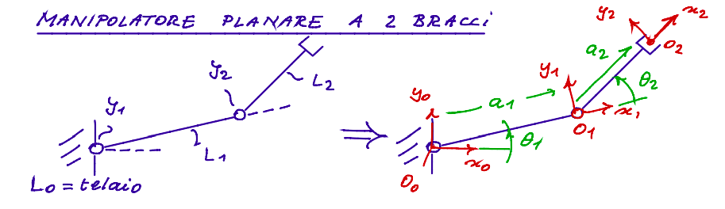
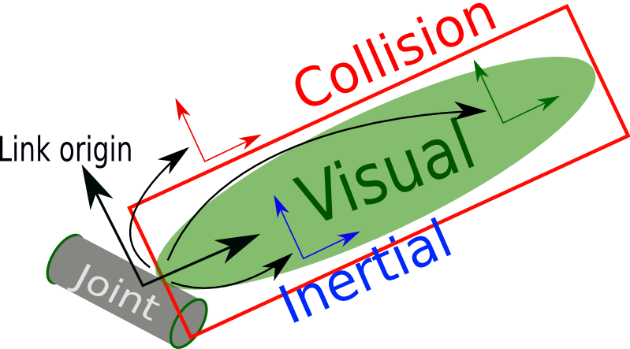
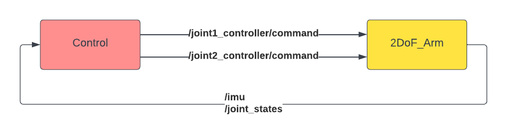

# Simulation on Gazebo of a 2 DoF Planar Manipulator
In this exercise, we will implement a 2 DoF Planar Manipulator on Gazebo. Let's start with some theory.

## Kinematics
Thanks to DH convention, we can write the **Forward Kinematics** of this type of manipulator:



$$
T_{2}^{0}(\theta_1, \theta_2) = 
\begin{bmatrix}
c_{12} & -s_{12} & 0 & a_1 c_1 + a_2 c_{12} \\
s_{12} & c_{12} & 0 & a_1 s_1 + a_2 s_{12} \\
0 & 0 & 1 & 0 \\
0 & 0 & 0 & 1
\end{bmatrix} = 
\begin{bmatrix}
R_z(\theta_1 + \theta_2) & r_2^{0} \\
0^T & 1
\end{bmatrix} \in SE(3)
$$

This homogeneous matrix of $SE(3)$ group, expresses the roto-traslation from a fixed frame $\{S_0\}$ to $\{S_2\}$. As you can see, the kinematic parameters of the kinematic chain are $a_1$, $a_2$. The joint variables are $\theta_1$ and $\theta_2$. We can also define the joint variable vector:

$$
q(t) = \begin{bmatrix} 
        \theta_1(t) \\ 
        \theta_2(t) 
       \end{bmatrix}
$$

The **Inverse Kinematics** can be easily computed using geometry. You can find the solutions [here](https://robotacademy.net.au/lesson/inverse-kinematics-for-a-2-joint-robot-arm-using-geometry/).


From $T_2^0(q)$, we can compute also the Jacobian Matrix $J(q)$, that map the joint velocities in the twist of end-effector:

$$
\xi = \begin{bmatrix} 
        v_x \\ 
        v_y \\ 
        \omega_z 
        \end{bmatrix} = J(q) \dot{q}
$$

$$
J(q) = 
\begin{bmatrix}
-a_1 s_1 - a_2 s_{12} & -a_2 s_{12} \\
a_1 c_1 + a_2 c_{12} & a_2 c_{12} \\
1 & 1
\end{bmatrix}
$$

We can add also the joint limit in our model. So we can add the constraints:

$$
\bar{q}_{low} \leq q(t) \leq \bar{q}_{up}
$$

## Dynamics
Using the Lagrangian approach, we can write the Equation of Motion (EoM) of our robot:

$$
M(q) \ddot{q} + C(q, \dot{q}) \dot{q} + G(q) = \tau
$$

with boundary conditions: $q(0) = q_0 \quad \dot{q}(0) = \dot{q}_0$.

The expressions of these matrices, can be found [here](https://www.ijeert.org/papers/v6-i11/3.pdf) or in whatever robotics book. The parameters of dynamics are:
- $m_1$, $m_2$: masses of the links.
- $I_1$, $I_2$: Inertia tensor of the links. With simple geometry, like cylinder, we can express them with a simple expressions of the previous parameters.
- $p_{CoG, i}$: position of the center of gravity (CoG) of the $i$-th link.
- $g$: $9.81 \ m/s^2$.

*Note that in a realistic simulation, we have to add some other terms in the EoM, like*:
- $Kq+D\dot{q}$: *Elastic or damping terms* 
- $J^{T}f$: *External Forces*.

## Discretization
We can write our EoM in state-space form, defining:

$$
\begin{cases}
x_1 = q  \\
x_2 = \dot{q} \\
u = \tau
\end{cases}
$$

From that:

$$
\begin{cases}
    \dot{x_1} = x_2 \\ 
    \dot{x_2} = - M^{-1}(x_1) \left( C(x_1, x_2) \ x_2  + G(x_1)\right) + M^{-1}(x_1) u
\end{cases}
$$

In compact form:

$$
\dot{x} = f(x) + g(x) u
$$

Where inertia matrix $M(q) \in R^{2 \times 2}$ is *positive definitive*. We can discretize with different discretization techniques. In Simulink, we choose an example *ode4* or other types of solver. The simplest is *Forward Euler* (in Simulink *ode1*, in the fixed step category). We can rewrite our model in algorithmic form:

$$
x_{k + 1} = x_k + T_s \left( f(x_k) + g(x_k) u_k \right)
$$

As you know, you have to choose a proper sampling period $T_s$ to avoid instability. The sampling period is another parameter of our simulation.

## Creation of the ROS pkg
After some theory, let's start to code. First, we create our package. So, type in your terminal:

```bash
cd catkin_ws/src
```
```
catkin_create_pkg robot_2DoF roscpp gazebo_msgs gazebo_plugins gazebo_ros gazebo_ros_control geometry_msgs sensor_msgs
```
There are a lot of dependencies. Some of these are gazebo-related. 

- `gazebo_ros`: This contains wrappers and tools for interfacing ROS with Gazebo.
- `gazebo_msgs`: Contains the definition of the messages of Gazebo, in order to interface with Gazebo from ROS.
- `gazebo_plugins`: Contains the dependencies needed to add sensors in our URDF model.
- `gazebo_ros_control`: This contains standard controllers to communicate between ROS and Gazebo.

There is also a new type of messages: `sensor_msgs`. You can find [here](http://wiki.ros.org/sensor_msgs) every type of standard sensor messages.

## Define Parameters
Open your package and create the `config` folder. Create `2dof_params.yaml`. Here we can add all parameters that we need. We can start to write only the kinematic and dynamic parameters. You can find the code [here](robot_2dof/config/2dof_params.yaml).

## Build the Robot
Now we can build our robot. Create the `models` directory and create `params_macro.xacro`. In this file, we import the parameters from the `yaml` file and define our macro, in order to write clean and **readble code**. After this, we can build our robot in the `2DoF_arm.xacro` file.

### Summarize of Xacro/URDF Syntax
- **Import Parameters from YAML file**:
```xml
<!-- \\\ Load YAML Files \\\ -->
<!--Declare the name of yaml file-->
<xacro:property name="yaml_file" value="$(find robot_2dof)/config/2dof_params.yaml"/>
<!--Load the parameters in a dictionary called "props"-->
<xacro:property name="props" value="${xacro.load_yaml(yaml_file)}"/>
```

- **Define a Parameter**:
```xml
<xacro:property name="joint_limit" value="3.14"/>
```
We can also assign the value from the `.yaml` file.
```xml
<xacro:property name="joint_limit" value="${props['kinematic_params']['joint_limit']}"/>
```


- **Check our** `.xacro` **file**.
```bash
check_urdf <(xacro 2DoF_arm.xacro)
```

- **Create a Link**: This is an example of a link, taken from [ROS Wiki](http://wiki.ros.org/urdf/XML/link).
```xml
 <link name="my_link">
   <inertial>
     <origin xyz="0 0 0.5" rpy="0 0 0"/>
     <mass value="1"/>
     <inertia ixx="100"  ixy="0"  ixz="0" iyy="100" iyz="0" izz="100" />
   </inertial>

   <visual>
     <origin xyz="0 0 0" rpy="0 0 0" />
     <geometry>
       <box size="1 1 1" />
     </geometry>
     <material name="Cyan">
       <color rgba="0 1.0 1.0 1.0"/>
     </material>
   </visual>

   <collision>
     <origin xyz="0 0 0" rpy="0 0 0"/>
     <geometry>
       <cylinder radius="1" length="0.5"/>
     </geometry>
   </collision>
 </link>
```
As you can see, `<link>` tag has 3 fields:
- `<inertial>`: This field define the inertial properties. In particular, you can assign the intertia tensor, mass and the position of center of gravity (CoG).
- `<visual>`: This field define what you can view in the simulation. You can assign the color, the geometry of the link and the size.
- `<collision>`: The collision properties of a link. Note that this can be different from the visual properties of a link, for example, simpler collision models are often used to reduce computation time. An example, a bounding box instead of a complex geometry.



- **Create a Joint**: This is an example taken from [ROS Wiki](http://wiki.ros.org/urdf/XML/joint).

```xml
 <joint name="my_joint" type="revolute">
    <origin xyz="0 0 1" rpy="0 0 3.1416"/>
    <parent link="link1"/>
    <child link="link2"/>

    <calibration rising="0.0"/>
    <dynamics damping="0.0" friction="0.0"/>
    <limit effort="30" velocity="1.0" lower="-2.2" upper="0.7" />
    <safety_controller k_velocity="10" k_position="15" soft_lower_limit="-2.0" soft_upper_limit="0.5" />
 </joint>
```

As you can see, it is possible to define a joint inside the `<joint>` tag. Inside this tag, you can define some attributes. The most important are:
- `<parent>` & `<child>`: Due to graph-based structure of URDF, you have to declare the parent and the child of the joint. *Remember that in URDF, you can NOT build parallel robot.* (Rough speaking, a joint can not have 2 parents.)
- `<origin>`: This is the transform from the parent link to the child link. The joint is located at the origin of the child link.
- `type`: Here, you have to define the type of joint (prismatic, rotoidal, etc.). You can find the complete list [here](http://wiki.ros.org/urdf/XML/joint).
- `<limit>`: In this tag, you have to specify the physical and kinematic limit of the joint. (i.e. $\bar{q}_i$).
- `<dynamics>`: In this tag, you can specify the damping or friction of your joint, in order to have a realist simulation.


- **Create a Macro**: You can simply define a macro with the tag `<xacro:macro>`. The template can be:
```xml
<xacro:macro name="my_macro" params="param1 param2">
```
Then, instantiate:
```xml
<xacro:my_macro param1="1" param2="2"/>
```
An example used in the `params_macro.xacro` is the inertial part of a cylinder link. In the following, the inertia tensor is computed with these [formula](https://en.wikipedia.org/wiki/List_of_moments_of_inertia#List_of_3D_inertia_tensors).

```xml
<!-- Inertial Matrix of Cylinder Link -->
<xacro:macro name="inertial_matrix" params="mass radius length cogx:=0 cogy:=0 cogz:=0">
    <inertial>
        <mass value="${mass}"/>
        <inertia ixx="${mass/12*(3*radius*radius + length*length) + mass*length*length/4}" ixy="0.0" ixz="0.0"
                        iyy="${mass/12*(3*radius*radius + length*length) + mass*length*length/4}" iyz="0.0" izz="${mass*radius*radius/2}"/>

        <origin xyz="${cogx} ${cogy} ${cogz}" rpy="0 0 0"/>
    </inertial>
</xacro:macro>
```

### Control the 2DoF Arm
You can actuate a joint, add in your URDF file, a `<transmission>` tag. Here, you can specify the type of the control you want to implement (Position Control, Velocity Control, Effort Control). It is convenient define a macro:
```xml
<xacro:macro name="transmission_block" params="joint_name location Type:=Position">
    <transmission name="tran_${location}">
    <type>transmission_interface/SimpleTransmission</type>
    <joint name="${joint_name}">
        <hardwareInterface>hardware_interface/${Type}JointInterface</hardwareInterface>
    </joint>
    <actuator name="motor_${location}">
        <hardwareInterface>hardware_interface/${Type}JointInterface</hardwareInterface>
        <mechanicalReduction>1</mechanicalReduction>
    </actuator>
    </transmission>
</xacro:macro>
```

After this, you have to load a `Gazebo Plugin`, that is call `gazebo_ros_control`. This plugin implement the controllers (usually a PID) in your Gazebo Simulation. To do that, you have to create the `<gazebo>` tag.

```xml
<gazebo>
    <plugin name="gazebo_ros_control" filename="libgazebo_ros_control.so">
        <robotNamespace>/2dof_arm</robotNamespace>
    </plugin>
</gazebo>
```

The simulation node, thanks to this plugin, is able to **subscribe a topic**, in which we can impose the desired position/velocity/effort. The PID gains must be specified in a YAML file. You can find the YAML file [here](/robot_2dof/config/2dof_actuation.yaml).

### Add Sensor
We can add sensors in our URDF model, using existing Gazebo plugin. An example, we can add an IMU on the end-effector (e-e), measuring the acceleration, angular velocity and orientation of the e-e. In a state-space view, you will have:

$$
\begin{cases}
\dot{x} = f(x) + g(x) u \\
y_{IMU} = h(x) + \nu
\end{cases}
$$

Where $\nu$ is the noise of the sensor. This formalism can be useful for **Sensor Fusion implementation** or the **study of the Observability**.

To add a sensor, you have to include the plugin that implement the sensor. In the case of IMU:
```xml
<gazebo reference="imu_link">
    <gravity>true</gravity>

    <sensor name="imu_sensor" type="imu">
        <always_on>true</always_on>
        <update_rate>${imu_freq}</update_rate>
        <visualize>true</visualize>
        <topic>__default_topic__</topic>
        <plugin filename="libgazebo_ros_imu_sensor.so" name="imu_plugin">
            <topicName>/2dof_arm/imu</topicName>
            <bodyName>imu_link</bodyName>
            <updateRateHZ>${imu_freq}</updateRateHZ>
            <gaussianNoise>${imu_noise}</gaussianNoise>
            <xyzOffset>0 0 0</xyzOffset>
            <rpyOffset>0 0 0</rpyOffset>
            <frameName>imu_link</frameName>
            <initialOrientationAsReference>false</initialOrientationAsReference>
        </plugin>
        <pose>0 0 0 0 0 0</pose>
    </sensor>
</gazebo>
```
Here you can specify the frequency, noise and the name of the topic.

### Launch the Simulation
To launch the simulation, you have to write a launch file, that you can find [here](/robot_2dof/launch/2DoF_control.launch). Let's explain the code:

- *Define Parameters*: We define also in the launch file local parameters, to readability.
```xml
<!-- these are the arguments you can pass this launch file, for example paused:=true -->
<arg name="paused"        default="false"    />
<arg name="use_sim_time"  default="true"    />
<arg name="gui"           default="true"    />
<arg name="headless"      default="false"   />
<arg name="debug"         default="false"   />
<arg name="model"         default="$(find robot_2dof)/models/2DoF_arm.xacro"/>
<arg name="verbose"       default="false"   />
<arg name="q1_init"       default="0.0"     />
<arg name="q2_init"       default="0.0"     />
```

These are a lot of parameters of the simulation in Gazebo. We also assign to `model` the path of file of our robot.

- *Launch Gazebo*: After this, we launch the simulation, calling the `empty_world.launch`, assigning its the parameters defined before.

```xml
<include file="$(find gazebo_ros)/launch/empty_world.launch">
<arg name="debug"         value="$(arg debug)"        />
<arg name="gui"           value="$(arg gui)"          />
<arg name="paused"        value="$(arg paused)"       />
<arg name="use_sim_time"  value="$(arg use_sim_time)" />
<arg name="headless"      value="$(arg headless)"     />
<arg name="verbose"       value="$(arg verbose)"      />
</include>
```

- *Load Robot Model*: Using the node `spawn_urdf`, we are able to load our model in the `empty_world`.

```xml
<param name="robot_description" command="$(find xacro)/xacro $(arg model)" />

<node name="spawn_urdf" pkg="gazebo_ros" type="spawn_model" 
        args="-param robot_description -urdf -model 2dof_arm"/>
```
We can also assign initial value of the joint (i.e. q(0)).

- *Launch Controllers*: For the actuation, we have to load the parameters of the controllers and launch the `controller_spawner` node.

```xml
<!-- Load File YAML-->
<rosparam file="$(find robot_2dof)/config/2dof_actuation.yaml" command="load"/>

<!-- Actuators -->
<node name="controller_spawner" pkg="controller_manager" type="spawner" respawn="false"
    output="screen" ns="/2dof_arm" args="joint_state_controller joint1_controller joint2_controller"/>
```

- *Publish Joint Information*: Thanks to `robot_state_publisher` node, we can publish the joint informations, simulating a *perfect encoder* (i.e. no noise).
```xml
<!-- convert joint states to TF transforms for rviz, etc -->
<node name="robot_state_publisher" pkg="robot_state_publisher" type="robot_state_publisher"
    respawn="false" output="screen">
    <remap from="/joint_states" to="/2dof_arm/joint_states"/>
</node>
```

## Launch Simulation
OK! Gazebo is very demanding, but now we are finally ready to launch the simulation. So, type in your terminal:
```
roslaunch robot_2dof 2DoF_control.launch
```
To list all topics:
```
rostopic list
```
You should obtain this output:
```
/2dof_arm/gazebo_ros_control/pid_gains/joint_1/parameter_descriptions
/2dof_arm/gazebo_ros_control/pid_gains/joint_1/parameter_updates
/2dof_arm/gazebo_ros_control/pid_gains/joint_2/parameter_descriptions
/2dof_arm/gazebo_ros_control/pid_gains/joint_2/parameter_updates
/2dof_arm/imu
/2dof_arm/joint1_controller/command
/2dof_arm/joint2_controller/command
/2dof_arm/joint_states
/clock
/gazebo/link_states
/gazebo/model_states
/gazebo/parameter_descriptions
/gazebo/parameter_updates
/gazebo/performance_metrics
/gazebo/set_link_state
/gazebo/set_model_state
/rosout
/rosout_agg
/tf
/tf_static
```

Let's focus on `/2dof_arm/imu` and `/2dof_arm/joint_states`. These topics are the *sensor* informations. You can use them as input for your control node. Topics `/2dof_arm/joint1_controller/command` is the topic that you can use as output in your control node (obv also in joint2 case). The other topics, can be used as the Ground Truth, in order to validate the control algorithms that you develop.



These topics contains these ROS msgs:
- [sensor_msgs/Imu](http://docs.ros.org/en/api/sensor_msgs/html/msg/Imu.html).
- [sensor_msgs/JointState](http://docs.ros.org/en/api/sensor_msgs/html/msg/JointState.html).

## Homework
You can divide in 4 groups:
1. **End-Effector Group**: Add to the 2 DoF Arm with a gripper as end-effector.

2. **Inverse Kinematics Group**: Try to implement a Inverse Kinematics node. This node take as input a desired 2D pose of the end-effector and publish the joint angles.

3. **Control Group**: Try to implement a Trajectory Tracking of the manipulator. You can choice an example a circular trajectory or whatever trajectory that you want to implement.

4. **Camera Group**: Try to add a Camera in the manipulator. You can find a brief tutorial [here](https://classic.gazebosim.org/tutorials?tut=ros_gzplugins#Camera).
